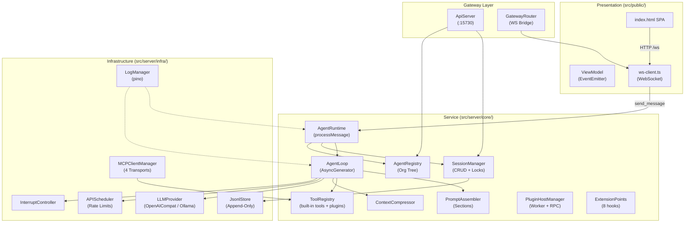
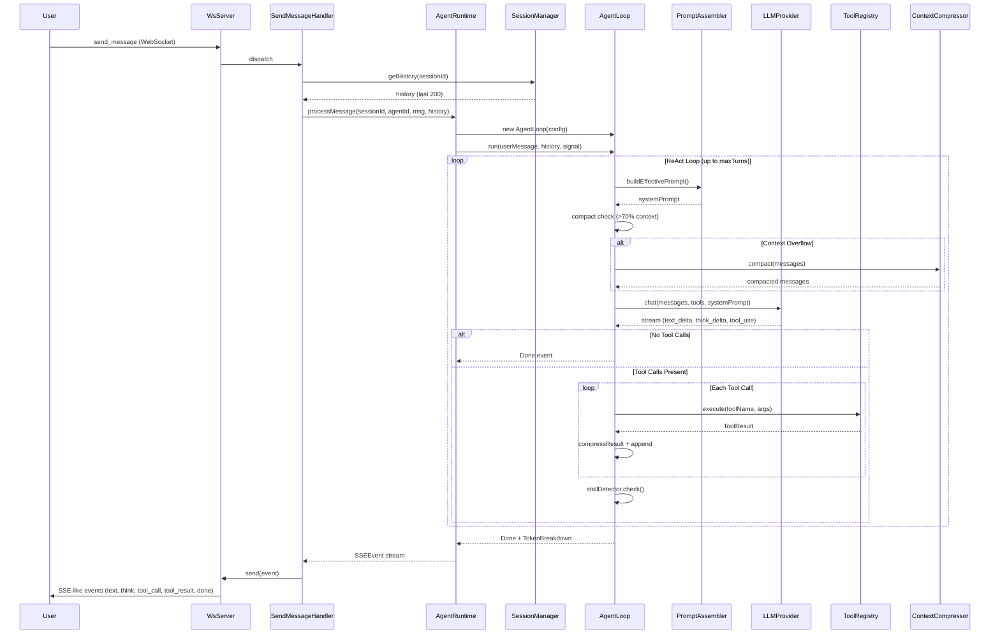
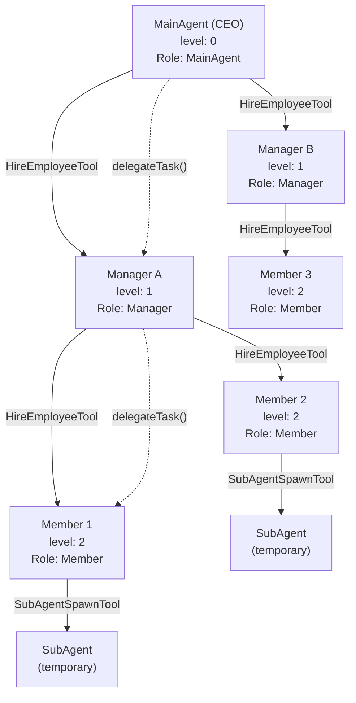
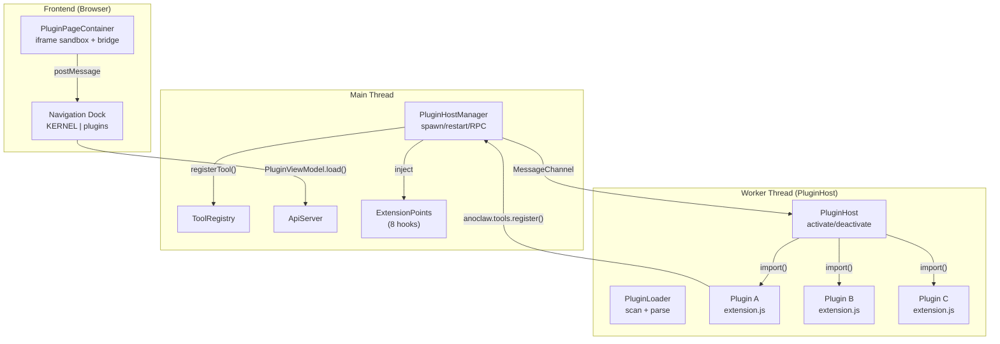
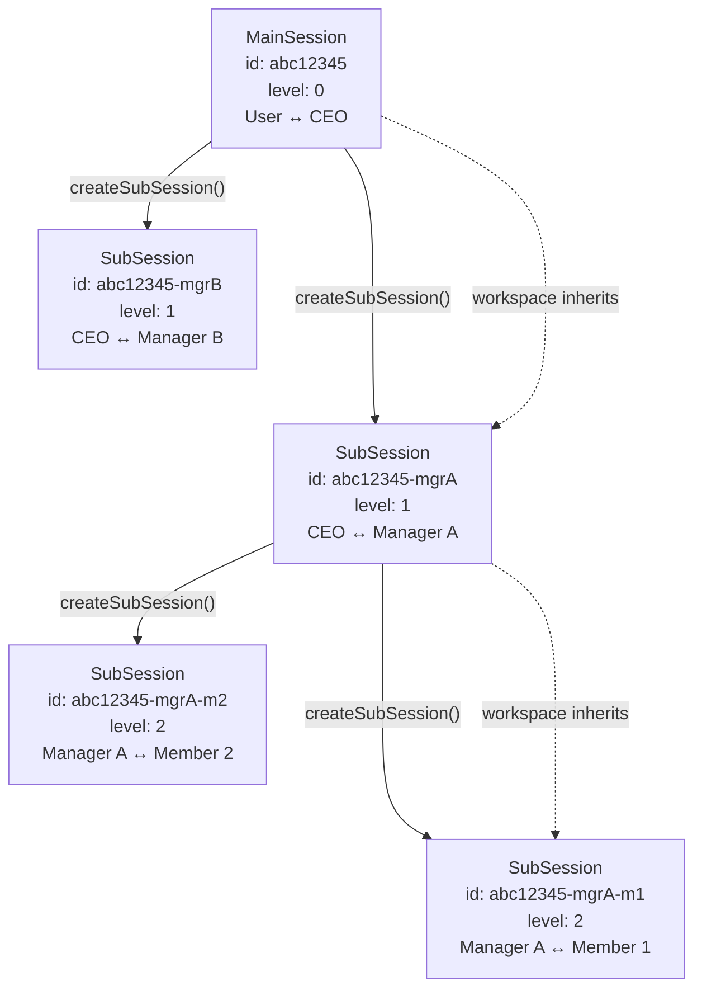

# AGENTS.md

This file provides guidance to AI coding assistants when working with code in this repository.

## Codex Source of Truth

AnoClaw is now developed with Codex. `AGENTS.md` is the canonical repository instruction file for AI coding work. Do not create or maintain Claude Code instruction files (`CLAUDE.md` / `CLAUDE.*.md`); migrate any still-useful guidance into this file or task-specific docs under `docs/`.
`DESIGN.md` is retired and must not be recreated or maintained. Project, architecture, product, and design guidance belongs in `AGENTS.md` or focused docs under `docs/`.

## Project Overview

AnoClaw v2.0 — AI desktop platform. An Electron-packaged Node.js application where users customize their own AI agents and tools through a plugin system. The kernel is frozen at ~17 files (process isolation, tool registry, event bus, LLM interface). Everything else is plugin territory. The frontend is a browser-based SPA, the backend is a single-threaded Node.js HTTP+WebSocket server. No Express, no database — pure `http` module with JSONL append-only storage.

## Commands

```bash
# Install dependencies (use npm, not pnpm — this project uses package-lock.json)
npm install

# Build TypeScript (both server and frontend)
npm run build

# Build frontend TypeScript only
npm run build:frontend

# Full build (server + frontend + CSS + Monaco + icons + plugin frontends)
npm run build:all

# Development — NOTE: `npm run dev` requires Windows cmd.exe (calls start-electron.bat)
# It will NOT work in Git Bash, WSL, or PowerShell. Use `npm run build:all` instead,
# then invoke the anoclaw-test-build skill to package and test.
npm run dev

# Start (requires prior build, same cmd.exe requirement as dev)
npm start

# Run tests (Vitest)
npm test

# Run tests in watch mode
npm run test:watch
```

**Build notes**: There are two TypeScript compilations:
1. Root `tsconfig.json` → `dist/` (server code, `src/server/**` + `src/shared/**`; excludes `src/public`)
2. `src/public/tsconfig.json` → `src/public/js/` (frontend code)

Always run `npm run build:all` if both changed. Path aliases `@shared/*`, `@server/*`, `@public/*` are configured in root tsconfig — they resolve at compile time only (no runtime module aliasing).

## Completion Workflow

AnoClaw uses Git as the durable completion record. Do not write Obsidian/vault work logs for coding sessions.
Treat removal of retired guidance files such as `DESIGN.md` as an intentional cleanup when it is part of the current task; do not restore them just to keep the worktree unchanged.

After verified code, docs, config, or skill changes:
1. Inspect `git status --short --branch` and review the relevant diff.
2. Stage only intentional files; never include unrelated user changes, secrets, local data, or build caches.
3. Create a concise git commit describing the completed work.
4. Push the current branch to `origin`; if no upstream exists, use `git push -u origin HEAD`.
5. Report verification, commit hash, branch, and push status to the user.

## Architecture

### Four-Layer Design

```
Presentation (src/public/)         HTML/CSS/TS — browser SPA, static files
    │ HTTP REST + WebSocket (ws://127.0.0.1:3456/ws?session={id})
ViewModel (src/public/ts/viewmodel/)  TypeScript classes + EventEmitter
    │
Service (src/server/core/)         AgentRuntime, SessionManager, PromptAssembler, ToolRegistry...
    │
Infrastructure (src/server/infra/)  LLM providers, JSONL storage, MCP transports, WorkerPool
```



### Two HTTP Servers (same process)

| Server | Port | Purpose |
|--------|------|---------|
| `main.ts` (HTTP + WS) | 3456 | Static files, WebSocket streaming, skill CRUD, API passthrough |
| `ApiServer` (REST) | 15730 | External AI agent control API, token-authenticated (localhost only) |

`main.ts` handles `/api/skills*` itself, all other `/api/*` routes delegate to `ApiServer.getInstance().handleApiRequest()`.

### Core Execution Flow

1. User sends message via WebSocket (`send_message`)
2. `main.ts` handler creates/loads session, appends user message to JSONL
3. Calls `AgentRuntime.processMessage()` → creates an `AgentLoop` (ReAct generator)
4. `AgentLoop` builds prompt via `PromptAssembler`, calls LLM via `LLMProvider`, executes tools via `ToolRegistry`
5. Each event (think/text/tool_call/tool_result) is yielded as SSE-like objects and pushed to client via WebSocket
6. Assistant response persisted to JSONL on completion



### Agent Hierarchy

- **MainAgent** (CEO, level 0): Always exists. Decomposes tasks, delegates to Managers/Members. Can communicate with user.
- **Manager** (level 1): Manages a team of Members. Can hire/fire Members via `HireEmployeeTool`.
- **Member** (level 2): Leaf workers. Execute tasks, cannot manage others. Can create SubAgents.
- **SubAgent**: Temporary, not persisted. Created/spawned by any agent via `SubAgentSpawnTool`. Destroyed when done.



Agents are NOT single-threaded — one agent can serve multiple sessions simultaneously because LLM APIs are stateless. Each session has independent context and its own `AgentLoop` instance.

### Plugin Architecture

Plugins run in a Worker Thread, isolated from the main process. Communication via bidirectional MessageChannel RPC.



Plugins declare contributions in `plugin.json`: tools, pages (iframe HTML), commands, skills, API routes, kernel overrides.

### Session Model

Sessions form a tree: `MainSession (User↔CEO)` → `SubSession (CEO↔Manager)` → `SubSession (Manager↔Member)`. Users can view all sub-sessions read-only but can only type in the main session. Each session stored as JSONL shards in `data/sessions/<sessionId>/`.



### Tool System

Built-in tools are registered in `registerAllTools()` via directory scan of `builtin/`. Every tool extends the abstract `Tool` class (EventEmitter-based). Additional tools are registered by plugins at runtime via `anoclaw.tools.register()` (RPC → PluginToolProxy → ToolRegistry). Each agent has an `allowedTools` whitelist. Key categories: File I/O (Read/Write/Edit/Glob/Grep), shell execution (Bash), native program launch (RunProgram), Web (Fetch/Search), agent management (HireEmployee/SubAgentSpawn), cross-agent communication (TaskAssign/AgentMessage), Plan mode, Memory, Skills, MCP, and Gateway.

### Storage: JSONL Append-Only

- `data/sessions/<id>/shard_NNNNNN.jsonl` — event stream (10K lines / 10MB / 30 day sharding)
- `data/sessions/<id>/meta.json` — session metadata (small, rewritable)
- `data/agents/<id>.json` — agent configuration
- `memory/team/` — shared team memories (markdown files)
- `memory/agents/<id>/` — per-agent memories

### Singleton Pattern

Most core services use `getInstance()` + `resetInstance()` (for testing):
`AgentRuntime`, `AgentRegistry`, `ToolRegistry`, `SessionManager`, `WsServer`, `ApiServer`, `SkillManager`, `MCPClientManager`, `LogManager`, `MemoryManager`

## Key Conventions

- **No Express**: All HTTP handled via raw `http` module. Use `handleRequest()` style functions.
- **ESM modules**: `"type": "module"` in package.json. Use `.js` extensions in imports (TypeScript compiles to ESM).
- **EventEmitter everywhere**: Services extend `EventEmitter`. Frontend ViewModels use EventEmitter for reactive updates.
- **WebSocket for real-time**: One persistent WS connection per session. Protocol defined in `src/shared/types/ws-protocol.ts`.
- **Generator-based agent loop**: `AgentLoop.run()` is an `AsyncGenerator<SSEEvent>`. `AgentRuntime.processMessage()` wraps it. This allows clean interrupt/stop via `AbortSignal`.
- **Path resolution**: `main.ts` sets `process.chdir(REPO_ROOT)` at startup. All file paths relative to repo root.
- **Frontend icons**: SVG only, no emoji. Icons in `src/public/icons/`.
- **Dark theme default**: CSS custom properties in `:root`, light theme via `[data-theme="light"]`.
- **Logging**: Uses `pino`. Logs to `logs/anochat.log`. `LogManager` singleton.
- **API Key encryption**: Agent configs store `apiKey` encrypted at rest (Web Crypto API).

## DeepSeek API Constraints (Important)

When working with DeepSeek-based LLM providers:
1. All messages in the API request MUST have a `role` field — this includes tool result messages.
2. `sanitizeOrphanedMessages()` in `AgentLoopLLM.ts` cleans orphaned tool messages before every LLM call. Always keep this in place.
3. DeepSeek does NOT support `image_url` message content type.
4. If `reasoning_content` is missing from the API response, save with empty string rather than omitting the field.

## Adding a New Built-in Tool

1. Create `src/server/core/tools/builtin/YourTool.ts` extending `Tool`
2. Implement `name()`, `description()`, `parametersSchema()`, `execute()`
3. Rebuild: `npm run build` (auto-registers via directory scan)

## Adding a New Plugin Tool (Zero Kernel Changes)

1. Edit the plugin's `extension.js` — call `anoclaw.tools.register({ name, description, parametersSchema, category })` in `activate()`
2. Export `executeTool(toolName, params)` to handle tool execution
3. Reload: `POST /api/v1/plugins/reload { name: "my-plugin" }` or restart
4. Tool appears in agent's tool list immediately. No kernel changes.

## Plugin System

VSCode-style extension architecture. Plugins live in `plugins/<name>/` with `plugin.json` + `extension.js`.

```
Plugins run in a Worker Thread, isolated from the main process.
Main ↔ Worker communication: bidirectional MessageChannel RPC.

Plugin Host lifecycle:
  1. PluginHostManager (main) spawns Worker (PluginHost)
  2. PluginHost scans plugins/, parses plugin.json, auto-activates onStartup plugins
  3. activate(anoclawAPI) → plugin registers tools/pages via RPC
  4. File watcher auto-reloads on directory changes
  5. Worker crash → auto-restart with exponential backoff

anoclaw API (what plugins see):
  - tools.register(def)       → RPC → PluginToolProxy → ToolRegistry
  - api.call(method, path)    → RPC → ApiServer.callInternal()
  - services are self-hosted by plugins — plugins register their own HTTP endpoints
  - log.{info,warn,error}(msg) → fire-and-forget log RPC
  - context.{pluginName, pluginPath, storagePath}

Kernel Extension Points (8 overridable hooks):
  promptAssembler, promptSections, memoryStore, sessionStore,
  settingsStore, llmProvider, toolExecutor, agentLoop
  Plugins declare overrides in plugin.json → handler loaded on activate.

Plugin API endpoints:
  GET    /api/v1/plugins             — list all plugins
  POST   /api/v1/plugins/reload      — reload a plugin
  DELETE /api/v1/plugins/:name       — uninstall (renames to .disabled)
  POST   /api/v1/plugins/install     — install from GitHub URL
  GET    /api/v1/plugins/market      — browse community registry
```

## LLM Provider Architecture

Two provider implementations in `src/server/infra/llm/`:
- `OpenAICompatibleProvider` — generic OpenAI-compatible API (url + apiKey + model). Used for DeepSeek, Anthropic via compatible endpoints, etc.
- `OllamaProvider` — local Ollama (url + model, no apiKey required)

Factory: `createLLMProvider(config)` in `provider-factory.ts` selects based on `provider` config field.
`APIScheduler` handles rate limiting (RPM/TPM) globally.

## Frontend (src/public/)

- Pure HTML/CSS/TypeScript SPA (no React/Vue framework at runtime — though `.tsx` files use JSX syntax compiled to vanilla JS)
- `index.html` → entry point
- `ts/viewmodel/` — ViewModel layer with EventEmitter
- `ts/components/` — UI components
- `ts/ws-client.ts` — WebSocket communication layer
- Navigation: 9-page PAGES menu — 5 kernel (Sessions, Agents, Skills, Memory, Settings) + divider + plugin pages (Plugins, MCP, Meeting, Gateway)
- Plugin pages loaded dynamically from plugin manifests via `PluginViewModel` → iframe sandbox + postMessage bridge
- Streaming: `StreamingMessageDelegate` renders tokens in real-time from WS events

## MCP Integration

`MCPClientManager` (singleton) manages connections to external MCP servers. Supports 4 transports: Stdio, SSE, WebSocket, Streamable HTTP. External MCP tools are dynamically proxied via `MCPToolProxy` and registered as `mcp_<server>_<tool>` in ToolRegistry. `MCPServer` class exposes AnoClaw itself as an MCP server.

## Skills System

Skills are markdown files with YAML frontmatter in `skills/` directory. Loaded by `SkillManager`, injected into system prompt via `SkillsSection` in PromptAssembler. Agents have per-agent `enabledSkills` whitelist. Built-in skills include: `anoclaw-tester`, `browser-automation`, `code-review`, `dispatching-parallel-agents`, `executing-plans`, `systematic-debugging`, `test-driven-development`, `verification-before-completion`, `writing-plans`.

## Configuration

- `config/settings.yaml` — app settings (port, logging, agent defaults, compression, supervision)
- `config/mcp_servers.yaml` — MCP server definitions
- Agent configs: `data/agents/<id>.json`
- `.mcp.json` — MCP server config (for browser-use tool)
