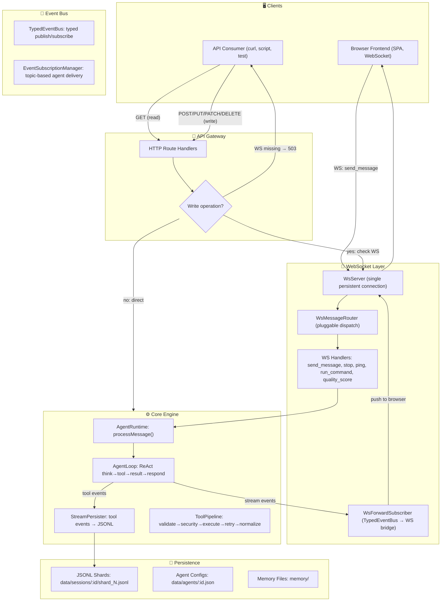

# AnoClaw API & WebSocket Architecture

> **Last updated:** 2026-06-27
> All write operations require WebSocket connection. Read operations use direct HTTP.

## Quick Facts

| Metric | Count |
|--------|-------|
| Builtin tools | 32 |
| Prompt sections | 18 |
| WS message types (Client→Server) | 6 |
| WS event types (Server→Client) | 26 |
| HTTP endpoints (total) | 82 |

---

## Data Flow Overview



---

## WebSocket Message Protocol

### Client → Server (6 types)

| Type | Description |
|------|-------------|
| `send_message` | Send user message + mode + effort + attachments |
| `stop` | Interrupt running agent loop |
| `ping` | Keep-alive |
| `run_command` | Slash command with args |
| `set_running_mode` | Toggle normal/infinite |
| `quality_score` | Rate a message (1-5 stars) |

### Server → Client (26 types)

| Event | Description |
|-------|-------------|
| `think` | Agent reasoning (streaming) |
| `text` | Agent response (streaming) |
| `tool_call` | Tool invoked |
| `tool_result` | Tool result |
| `todo_write` | Task list update |
| `plan_enter` / `plan_exit` | Plan mode lifecycle |
| `subsession_created` | Sub-agent session created |
| `delegation_status` | Delegation lifecycle |
| `delegation_progress` | Live sub-agent output |
| `task_notification` | Background task completed/failed |
| `task_list_update` | Task panel refresh |
| `session_created` | New session |
| `message_appended` | Message persisted |
| `workspace_changed` | Workspace path updated |
| `agent_status` | Agent online/offline/working |
| `agent_registered` | New agent added |
| `tool_execution_started` / `tool_execution_completed` | Tool lifecycle |
| `loop_completed` | Agent loop finished |
| `compaction_triggered` | Context compaction occurred |
| `command_result` | Slash command output |
| `error` | Error message |
| `done` | Streaming complete |
| `status` / `sleep` / `wake` | Agent state changes |
| `plugin:ui:mount` / `plugin:ui:unmountAll` | Plugin UI injection |

---

## API Endpoint Status

### Read Operations — Direct HTTP

| Category | Count | Examples |
|----------|-------|----------|
| System | 13 | `/health`, `/stats`, `/logs/*`, `/settings`, `/endpoints`, `/prompt/*`, `/ws/connections` |
| Sessions | 12 | `/sessions`, `/sessions/:id`, `/sessions/tree`, `/sessions/:id/messages`, `/sessions/:id/workspace` |
| Agents | 8 | `/agents`, `/agents/org-tree`, `/agents/:id`, `/agents/:id/prompt` |
| Tools | 6 | `/tools`, `/tools/groups`, `/tools/:name`, `/tools-for-agent/:id` |
| Skills | 3 | `/skills`, `/skills/:name`, `/skills/for-agent/:id` |
| Memory | 2 | `/memory`, `/memory/search` |
| Workspace | 2 | `/workspace/browse`, `/workspace/read` |
| Plugins | 8 | `/plugins`, `/plugins/:name`, `/plugins/extensions`, `/plugins/:name/storage` |
| **Total read** | **54** | |

### Write Operations — Require WebSocket

| Category | Count | Method |
|----------|-------|--------|
| Session | 8 | POST/PATCH/DELETE |
| Agent | 6 | POST/PATCH/DELETE |
| Memory | 3 | POST/PATCH/DELETE |
| Workspace | 5 | POST/DELETE/PATCH |
| Settings | 1 | PUT |
| **Total write** | **~28** | |

Write endpoints return **503** if no WebSocket connection is active.

---

## TypedEventBus Topology

```
Producers                          Bus                      Consumers
─────────                          ───                      ─────────
BackgroundTaskManager ─────────┐                            ┌─→ WsForwardSubscriber (→ WS → Browser)
  task:completed/failed        │                            │
AgentRuntime ─────────────────┤                            ├─→ EventSubscriptionManager (→ Agent injection)
  delegation:*                 │   ┌──────────────────┐    │
AgentDelegation ───────────────┤   │                  │    ├─→ AgentRuntime._subscribeToTaskNotifications
  delegation:progress          ├──→│  TypedEventBus    │───→│     (→ <task-notification> XML)
SessionManager ────────────────┤   │  open-ended map   │    │
  session:*                    │   │                  │    └─→ InterruptController (→ agent wake)
AgentRegistry ─────────────────┤   └──────────────────┘
  agent:*                      │
ToolRegistry ──────────────────┘
  tool:execution_*
```

TypedEventMap is open-ended (`[event: string]: unknown`) — kernel never needs updating for new event types. Plugin events (`plugin:*`) use the wildcard key.

---

## File Map

```
src/
├── shared/types/
│   ├── events.ts           TypedEventMap (open-ended) + WsMessageType
│   ├── ws-protocol.ts      WsClientMessage + WsServerMessage
│   ├── session.ts          Message, Session, JsonlEvent
│   └── agent.ts            AgentRole, AgentState, AgentConfig
│
├── server/
│   ├── main.ts             Entry: HTTP + WS server, checkpoint recovery
│   ├── gateway/
│   │   ├── ApiServer.ts        HTTP routing + dispatch
│   │   ├── handlers/           Session, Agent, Workspace, Tool, System
│   │   └── routes/             Memory, Settings, AgentControl, etc.
│   ├── core/
│   │   ├── agent/
│   │   │   ├── AgentRuntime.ts        processMessage, delegateTask
│   │   │   ├── AgentLoop.ts           ReAct loop engine
│   │   │   ├── AgentLoopLLM.ts        LLM call + sanitizeOrphanedMessages
│   │   │   ├── AgentLoopCompaction.ts Compact + rebuild messages
│   │   │   └── supervision/           InterruptController, BackgroundTaskManager
│   │   ├── events/
│   │   │   ├── TypedEventBus.ts       Central pub/sub
│   │   │   └── EventSubscriptionManager.ts
│   │   ├── tools/
│   │   │   ├── ToolRegistry.ts        32 tools auto-register
│   │   │   ├── ToolPipeline.ts        5-stage execution
│   │   │   └── builtin/              32 tool files
│   │   └── prompt/
│   │       ├── PromptAssembler.ts     System prompt builder
│   │       └── sections/             18 sections (dynamic + static)
│   └── infra/
│       ├── network/
│       │   ├── WsServer.ts
│       │   └── handlers/             SendMessage, Stop, Ping, RunCommand
│       └── StreamPersister.ts        Streaming → JSONL
│
└── public/
    ├── ts/
    │   ├── app.ts                    App bootstrap + WS wiring
    │   ├── anoclaw-api.ts            window.anoclaw init (25 components)
    │   ├── UIComponentRegistry.ts    Component swap registry
    │   ├── SlotRegistry.ts           Plugin slot injection
    │   ├── ToolCardRegistry.ts       Tool card override registry
    │   ├── handlers/ChatHandlers.ts  Frontend WS dispatch (20+ types)
    │   ├── viewmodel/
    │   │   ├── WSClient.ts           Auto-reconnect WS client
    │   │   ├── SessionAgent.ts       Per-session agent state
    │   │   └── ConversationViewModel.ts
    │   └── components/
    │       ├── pages/SessionsPage.ts  Chat rendering + delegate dispatch
    │       ├── ui/                   21 reusable components
    │       └── conversation/delegates/ 15+ message delegates
    └── css/                          19 CSS files → bundle.css
```

## Key Design Rules

| Rule | Why |
|------|-----|
| **All write APIs require WebSocket** | Frontend state stays in sync; prevents silent data loss |
| **send_message always goes through WS handler** | StreamPersister for per-event JSONL; auto-title; workspace inheritance |
| **Read APIs use direct HTTP** | No WS overhead; cacheable; works without browser |
| **TypedEventBus is the single integration point** | Backend never calls frontend directly; WsForwardSubscriber is the only bridge |
| **One WS connection per browser** | All sessions share one connection; events carry sessionId |
| **503 on write without WS** | Clear signal that browser connection is needed |
| **Plugins auto-reload via file watcher** | Write to plugins/<name>/, no restart needed |
