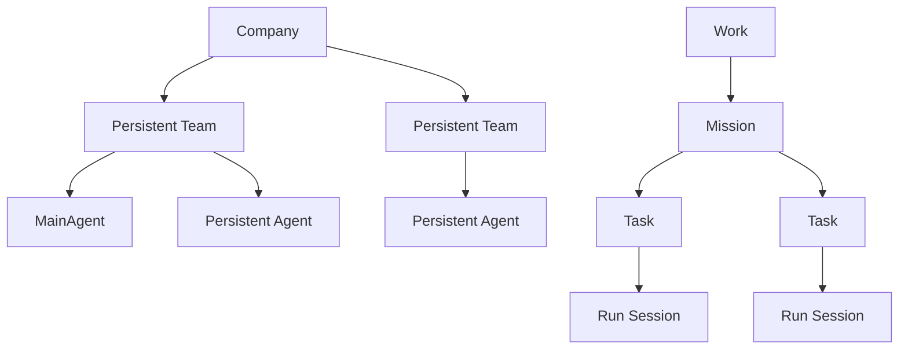

# AnoClaw 3.0 多 Agent 协作

AnoClaw 把多 Agent 系统表现为一家可持续成长的本地 AI 公司。

## 用户交互边界

- 用户默认且仅直接向当前 Work 的 MainAgent 主会话输入。
- MainAgent 自主创建持久 Team、Agent、Mission 和 Task。
- 员工 Run Session 对用户只读，用于透明展示委派、工具执行、交流和结果。
- 选择员工会话不会改变输入目标；输入框始终属于 MainAgent。

这让普通用户只需要说明目标，同时让需要审计和趣味性的用户能看到公司如何工作。

## 持久公司模型

Team 是唯一组织模型。Agent 可以加入多个 Team，但恰好有一个主要成员关系。Team 可以嵌套，但不再使用 CEO、Manager、Member 的硬编码执行层级。

每个 Agent 都是持久的完整 Agent：拥有独立身份、提示、能力、工具、Skills、记忆和执行会话。MainAgent 的区别是职责和用户入口，不是运行时能力等级。

3.0 已移除 `HireEmployee`、`ListEmployees`、`UpdateOrg`、`SubAgentSpawn`。创建或邀请员工使用 `TeamMemberAdd`，组织成长始终落入持久 Team。

## 工作模型

- Work 是用户看到的任务/项目统一容器。
- 一次性 Work 不绑定文件夹。
- 项目 Work 绑定可复用 Workspace。
- Mission 描述阶段目标、验收标准和验证策略。
- Task 是可依赖、可分配、可恢复的最小协作单元。
- Run 是一次真实 Agent 执行尝试。
- Session transcript 是透明、持久、可重放的对话与工具记录。

Task 只有在 AgentLoop 真实结束、TaskReport 已写入且验证策略通过后才完成。分配或认领绝不等于完成。

## 调度与安全

- Scheduler 由持久事件唤醒，不依赖 Agent 轮询。
- 每个根公司默认最多 4 个并行 Run。
- 每个 Agent 同时最多执行一个写任务；只读任务可按策略并行。
- 项目写任务通过 Git task worktree 或悲观路径租约隔离。
- Bash 和 RunProgram 视为全 Workspace 写操作。
- 停止 Work 或 Task 会级联中断 Run、关闭 Session、释放租约并持久化原因。

## 通信

`AgentMessage` 只在 Team 内工作：

- `note` 可以排队到员工的下一次 Run。
- `steer` 只能发给正在运行的员工。
- 广播会为每个接收者产生独立 FIFO 投递记录。
- 消息经历 queued、delivered、consumed、acknowledged；崩溃后从持久状态恢复。

## 验收

- `automatic`：服务端按验收标准和证据自动判定。
- `independent_agent`：指定的另一个持久 Agent 使用 `TaskVerify`。
- `user`：用户在 Work 界面通过或要求修改。

未通过的 Task 进入 `revision_required`，Scheduler 按最大重试次数创建新的 Run。
