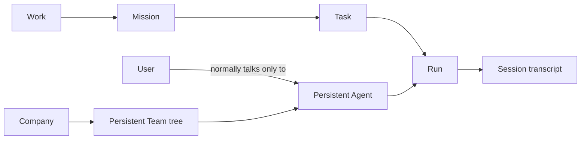

# AnoClaw 3.0 Architecture

AnoClaw 3.0 is a local-first autonomous AI company. It presents one simple
conversation with MainAgent while keeping the organization, delegation,
agent-to-agent communication, execution evidence, and deliverables observable.

## Product model



- One local Company exists per installation.
- Teams are persistent, nested, and grow with the Company.
- Team membership carries a responsibility (`leader` or `member`); it does not
  create a different Agent engine.
- Every Agent has an independent prompt, model configuration, capabilities,
  skills, tools, memory, sessions, and runtime state.
- MainAgent is the default user-facing Agent and owns company-level outcomes.
- Other Agents communicate through durable Team collaboration. The user may
  inspect those conversations but does not need to operate them manually.
- A Work may be a one-off request or a long-running project. A Workspace is an
  optional filesystem boundary, not a synonym for Work.
- A Session is transcript and execution evidence only. Organization and task
  state never live in Session metadata.

## Durable domains

AnoClaw 3.0 does not import or dual-write the v2 organization, task, or session
models. Its source of truth is under `data/v3/`:

```text
data/v3/
  company/install-company/events.jsonl
  company/install-company/projection.json
  work/<work-id>/events.jsonl
  work/<work-id>/projection.json
  transcript/<session-id>/events.jsonl
```

JSONL is the source of truth. `projection.json` files are rebuildable startup
checkpoints. Every event has schema version 3, an idempotency key, a monotonic
revision, an actor, and optional correlation/causation identifiers.

The Company stream owns Company, Workspace, Team, TeamMembership, and Agent.
Each Work stream owns Work, Mission, Task, Run, Session metadata, TaskReport,
CoordinationMessage, WorkspaceLease, OrchestrationDecision,
VerificationRecord, and ToolCallJournalRecord.

## Execution invariants

1. A Task dependency is released only after the predecessor is durably
   `completed`.
2. Claiming a Task, creating its Run, and creating the Run Session is one
   atomic Work event.
3. A Run succeeds only after AgentLoop emits `Done`, a non-empty TaskReport is
   stored, and the Mission verification policy passes.
4. Every terminal path closes the Run Session and releases its Workspace
   resources.
5. One Agent may execute in multiple Works, but per-Agent and per-Mission
   capacity limits are enforced by the server-owned scheduler.
6. Agent-to-Agent messages are FIFO and persistent. They move through
   `queued → delivered → consumed → acknowledged`; only the consuming turn may
   acknowledge them.
7. Every tool call is write-ahead journaled. An interrupted read may be
   replayed; an ambiguous write becomes `recovery_required` and is never
   silently repeated.
8. A write tool must be allowed by the Agent, Team policy, and Task policy,
   and must hold a current Workspace lease with the Run fencing token.
9. Git Workspaces use per-task worktrees and an integration branch. Non-Git
   Workspaces use pessimistic path-prefix leases.
10. API keys and full private prompts are not written to coordination events.

## Team-only organization

`HireEmployee`, `ListEmployees`, `UpdateOrg`, and temporary `SubAgentSpawn` are not public 3.0
operations. Persistent collaboration uses:

- Team create, update, archive, and status operations.
- Team member add, update, and remove operations.
- Adding a new employee is an atomic Team member operation that creates a
  persistent Agent and its primary Team membership together.
- Mission and Task operations always name the responsible persistent Team.
- Agent messages are addressed within Work and Team context.

This keeps the product mental model small: users see a Company made of Teams,
while MainAgent handles organization changes autonomously.

## User interface

The 3.0 shell has three primary surfaces:

- **Work** — MainAgent conversation, execution summary, company activity,
  deliverables, and the transparent company floor.
- **Company** — persistent Teams, Agents, Workspaces, responsibilities, and
  status.
- **Settings** — local model/runtime settings, language, and simple or
  professional layout.

The fixed interface copy supports persisted `zh-CN` and `en-US` switching.
User content, Agent names, transcripts, and deliverables remain in their
original language.
