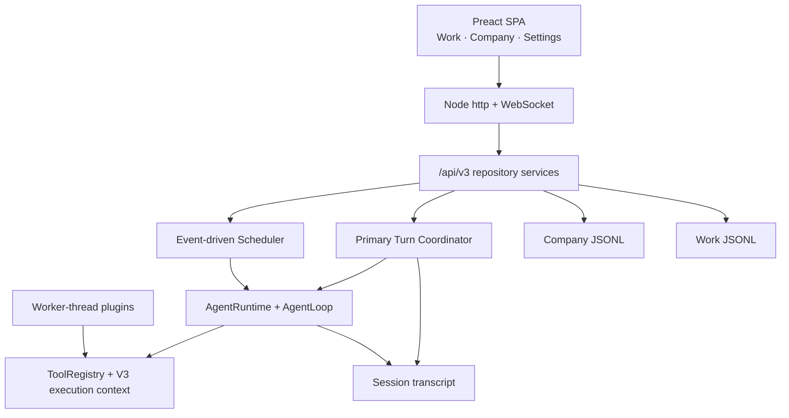

# AnoClaw 3.0 架构总览

AnoClaw 是 Electron 打包的本地 AI 公司运行时。详细领域设计见 [anoclaw-3-architecture.md](anoclaw-3-architecture.md)。

## 边界

- UI 使用 Preact 编译为静态资源，没有远端账户系统。
- 主 HTTP/WS 服务监听本地端口 3456。
- 外部控制 API 仍由 localhost ApiServer 提供。
- `/api/v3` 是 3.0 产品领域接口；旧组织/任务存储不是公开事实源。
- `data/v3` 是新版本数据根目录。
- 插件继续运行在 Worker Thread，通过 RPC 注册工具和页面。

## 执行

用户消息只进入 Work 的 Primary Session。Primary Turn Coordinator 串行化同一主会话，AgentLoop 结束后立即把 Session 设为 Idle。

员工 Task 由 Scheduler 从持久 Work 投影选择。V3RunExecutor 负责 Run/Session 状态、超时、重试、验证、租约、WAL 和停止级联；V3RunAgentTurnExecutor 把持久 Agent snapshot 接入现有 AgentRuntime。

## 实时

JSONL fsync 后，V3 Event Hub 发布带 revision 的事件。客户端初始化读取 REST snapshot，WebSocket 只做低延迟增量；断线重连从 revision 续播，发现缺口则重新获取 snapshot。
