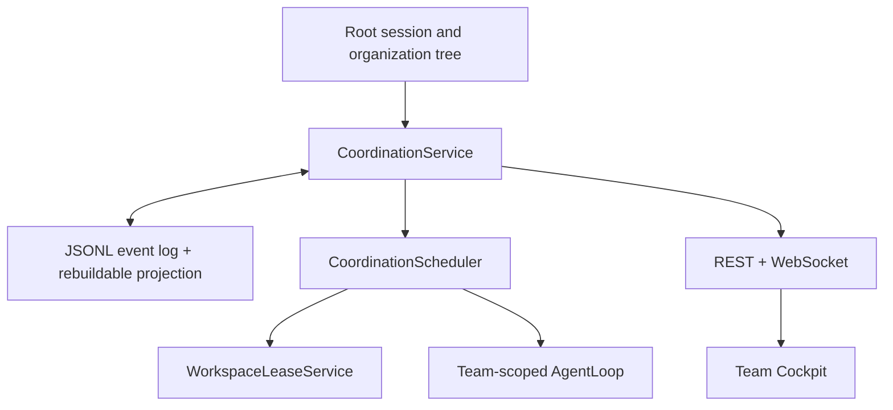
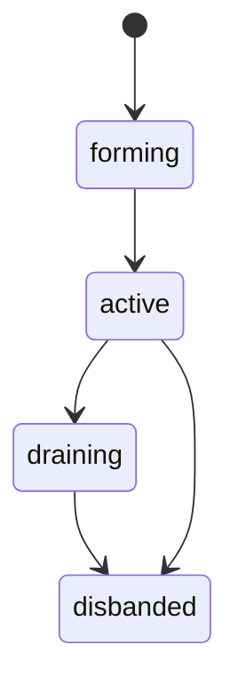
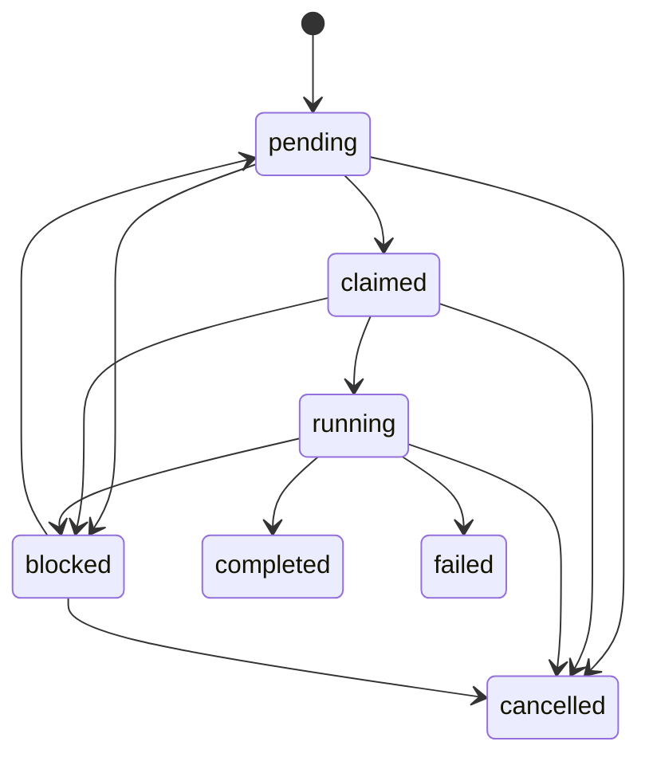

# Multi-Agent Coordination

AnoClaw combines a durable organization tree with a root-session-scoped,
temporary collaboration Team. The Team is an overlay: it references existing
active employees, does not copy their configuration, and never changes
`role`, `parentAgentId`, or the organization chart.

## Architecture



The source of truth is
`data/coordination/<rootSessionId>/shard_NNNNNN.jsonl`. Every mutation receives
a monotonically increasing root revision. `projection.json` accelerates startup
but can always be rebuilt by replaying the event log.

The event stream contains Team, Task, Message, Lease, and workspace-conflict
changes. Writes are serialized per root session, support idempotency keys, and
use optimistic task versions for concurrent updates.

## Team lifecycle

A root session may have at most one `forming` or `active` Team. A Team holds a
leader and up to the configured member limit, all of which are references to
active permanent employees. One employee may participate independently in
different root sessions.



The Team leader and root MainAgent may remove members or disband. Removing a
busy member or disbanding with non-terminal tasks requires `force`; force first
cancels affected work and releases leases. The scheduler automatically disbands
an `autoDisband` Team after every Team task is terminal and no queued or
delivered-but-unacknowledged Team message remains for the configured grace
period.

Each member has a stable execution session scoped by root session, Team, and
agent. A Team does not create a second organization identity.

## Durable task state machine

Hierarchy, swarm, and temporary SubAgent work share `CoordinationTask`.



Terminal states cannot be reopened by an ordinary update. An explicit retry
creates a new attempt and returns the task to `pending`. Dependencies become
ready only after every referenced task is durably `completed`; dependency
creation rejects missing nodes, self-dependencies, and cycles.

Claims, assignments, transitions, and version checks run under the root write
lock, so two workers cannot claim the same version. The scheduler orders ready
work by `urgent`, `high`, `normal`, and `low`, uses FIFO within a priority, and
ages waiting tasks to prevent starvation. It also enforces:

- the configured per-root concurrency limit;
- one running task per Team member session;
- direct-subordinate assignment in hierarchy mode;
- Team membership in swarm mode;
- non-conflicting workspace leases before execution;
- bounded runtime and automatic retries for transient provider errors.

An assignment is not completion. `AgentRuntime.runCoordinationTask()` changes a
claimed task to running, starts the worker loop, records heartbeat and current
tool, and commits completed only after `AgentLoop` yields `Done`. Timeout,
interrupt, and failure persist their actual outcome and always release leases.

## Task packet and output

Workers receive a structured `TaskPacket` containing the goal, description,
acceptance criteria, constraints, selected parent-session excerpts, dependency
results and evidence, workspace, Team roster, write scope, and available tools.

The result stores a summary, evidence, and an `outputRef` to the worker session
transcript. `TaskOutput` reads that durable transcript after in-memory caches
expire or the server restarts.

Temporary SubAgents support:

- `isolated`: only the explicit task packet;
- `summary`: selected parent context, the default;
- `fork`: full parent history with the same effective agent prompt.

A forked temporary agent cannot recursively fork. Temporary agent configuration
is always destroyed, while the task, transcript, and output remain.

## Durable mailbox

Each logical recipient gets an ordered `CoordinationMessage` record with
`queued`, `delivered`, `acknowledged`, or `dead_letter` state. Broadcast creates
one record per recipient so delivery and failure are independently auditable.

The EventBus is only a low-latency wake-up path. The JSONL mailbox is authoritative.
`AgentLoop` drains a configured FIFO batch at safe turn boundaries and appends
messages with their message ID as the idempotency key. A restart cannot duplicate
already injected messages.

Inside a Team, any member may message a peer or broadcast. Hierarchy mode keeps
parent/child restrictions. A `steer` targets running work and fails
structurally for an offline recipient; a normal `note` may queue until the next
task.

## Shared workspace safety

Write scopes are normalized workspace-relative path prefixes. Equal paths and
ancestor/descendant paths conflict. Read-only tasks acquire no write lease and
may run together; disjoint write scopes may run together.

`"."` represents the full workspace. Missing scopes on a write task normalize
to `"."`. Bash and native program execution require `"."` because their write
effects cannot be statically bounded.

The scheduler acquires leases before a task enters the tool pipeline.
`ToolPipeline` then independently verifies `TaskExecutionContext`, the task
mode, declared scope, actual target, and live lease. This prevents a worker
from bypassing scheduling by invoking a write tool directly. Conflicts persist
as blocked tasks with an auditable workspace-conflict event and notify the
leader.

Leases renew with task heartbeat and release on completion, failure,
cancellation, timeout, forced member removal, forced Team disband, and restart
recovery.

## Recovery

At startup the service replays each root event stream and restores its
projection and live mailbox. Recovery performs these task repairs:

- `claimed` returns to `pending` after releasing stale leases;
- `running` becomes `blocked` with `recovery_required`;
- terminal tasks release any stale lease;
- queued and delivered-but-unacknowledged messages remain recoverable.

AnoClaw never blindly replays an unconfirmed write. A blocked recovered task
requires an explicit retry after its transcript and workspace are reviewed.
Sessions left Active without a live controller are reconciled to Idle.

The first coordination startup writes `data/coordination/schema.json`. Existing
agent configurations that already opted into the legacy delegation tool family
are migrated to the new Team, Task, Message, SubAgent, and Job tool contract;
custom agents without delegation tools remain restricted. Existing session
transcripts are not rewritten and legacy in-memory background records are not
imported.

## Public contract

REST endpoints:

- `GET/POST /api/v1/sessions/:rootSessionId/teams`
- `GET/PATCH/DELETE /api/v1/teams/:teamId`
- `GET/POST /api/v1/sessions/:rootSessionId/tasks`
- `GET/PATCH /api/v1/tasks/:taskId`
- `POST /api/v1/tasks/:taskId/assign`
- `POST /api/v1/tasks/:taskId/claim`
- `POST /api/v1/tasks/:taskId/retry`
- `POST /api/v1/tasks/:taskId/stop`
- `GET /api/v1/sessions/:rootSessionId/coordination-events?afterRevision=N`

Invalid transitions return 422, optimistic-version and lease conflicts return
409, and unknown or cross-root records return 404.
Clients may send `Idempotency-Key` on Team and Task creation requests; retries
return the original durable record, including after restart or later lifecycle
changes.

WebSocket change notifications are `team_changed`, `task_changed`,
`task_progress`, `coordination_message`, `workspace_conflict`, and
`coordination_snapshot_required`. Every event includes the root session and
monotonic revision. A client detects a revision gap by reloading the REST
snapshot before accepting later events.

The Team Cockpit renders its roster, task board, timeline, leases, conflicts,
and process Jobs from that server projection. The Agents page adds Team and task
badges without changing the organization chart.

## Configuration

```yaml
coordination:
  autoSwarm:
    enabled: true
    minParallelTasks: 2
  maxConcurrentTasksPerRoot: 4
  maxTeamMembers: 8
  maxTaskRuntimeMs: 600000
  maxAutomaticRetries: 2
  autoDisbandGraceMs: 30000
  messageBatchSize: 20
  workspaceLeaseTtlMs: 30000
```

Disabling `autoSwarm.enabled` removes automatic Team guidance from the
coordinator prompt. Manual Team tools remain available.
