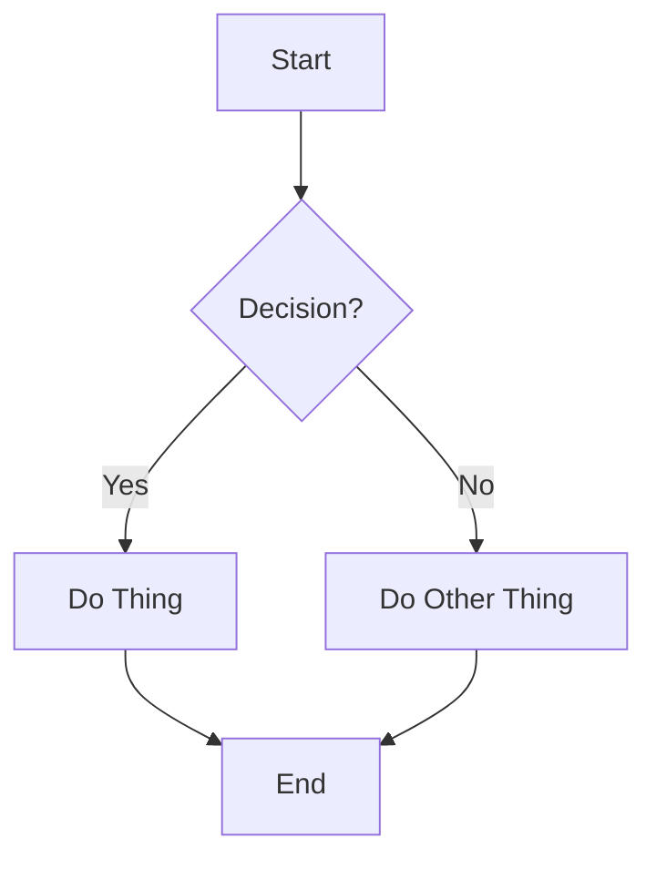
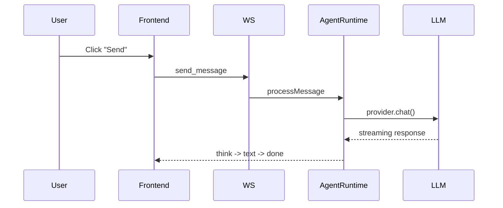
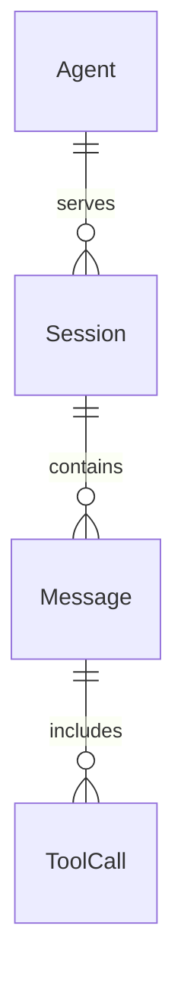
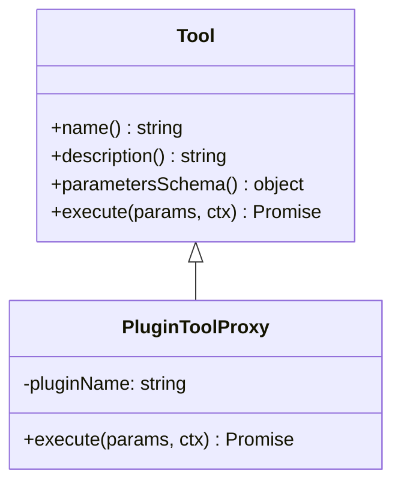
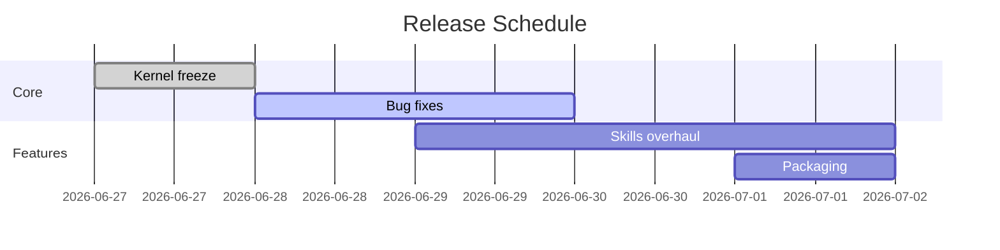
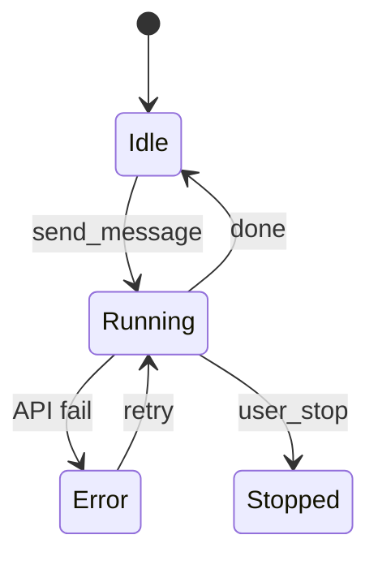

# Markdown & Mermaid Diagrams

## Agent Handoff

- Use this skill only when its `when_to_use` guidance matches the assigned task.
- If you are a child agent, keep the skill output focused on the parent assignment and report verification or blockers clearly.
- Do not override higher-priority system, permission, or delegation rules.

Text-based diagrams that render everywhere. No drawing tools needed.

## Mermaid Diagram Types

### Flowchart

### Sequence Diagram

### Entity Relationship

### Class Diagram

### Gantt Chart

### State Diagram

## Diagram Best Practices

- **Flowcharts**: For processes, decisions, workflows
- **Sequence**: For API calls, message passing, request/response
- **ER**: For data models, table relationships
- **Class**: For OOP architecture, inheritance, interfaces
- **Gantt**: For timelines, sprints, release planning
- **State**: For lifecycle, state machines, status transitions

## When to Use Diagrams

> [!tip] Use a diagram when
> - Explaining architecture to someone new
> - Showing data flow between 3+ components
> - Illustrating a multi-step process
> - Comparing before/after states
> - The user says "I don't understand how this works"

> [!note] Skip the diagram when
> - Explaining a single function
> - The user already knows the system
> - It's obvious from the code
